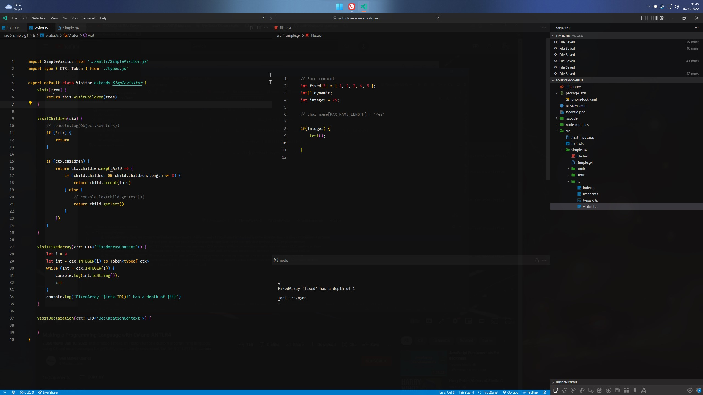

# Antlr4 Typescript Template

Since `antlr4ts` doesn't work (at least for me) — I'm taking advantage of inferring the types generated by `antlr4` instead.

## Get Started

- Install **java** and **antlr4** ([Windows](https://github.com/antlr/antlr4/blob/master/doc/getting-started.md#windows))
	- Only 1. and 2. are required as `package.json` references antlr4; `java org.antlr.v4.Tool`
- Clone the project
- Install project `pnpm i`
- Generate **antlr4** files `pnpm gen`
- Run the development command `pnpm dev`

### `pnpm dev`
It looks for 
- folders matching `src/*.g4/`
	- a grammar file `src/*.g4/.*g4`
	- test input file(s) `src/*.g4/*.test`
		- If file begins with period (`.`) it is ignored
	- an entry-point for running antlr4 `src/*.g4/ts/index.ts`

Outputs generated **antlr** files to `src/*.g4/antlr`

When ***test-input*** changes, it will rerun the ***entry-point*** function. 
When `.g4` changes, it wiil generate **antlr4** and restart nodemon. 
When `.js` or `.ts` changes within `src/*.g4/`, nodemon will rerun the application.

## References
To develop and understand `antlr4` better

- [GitHub Antlr4 Documentation](https://github.com/antlr/antlr4/blob/master/doc/index.md)
- [A Course for Antl4](https://youtu.be/2o9ImGNI1uw)
- [Talk - Alena Khineika: Writing compilers in JavaScript using ANTLR](https://youtu.be/-Gtsh9VlycI)

  

### My IDE setup
